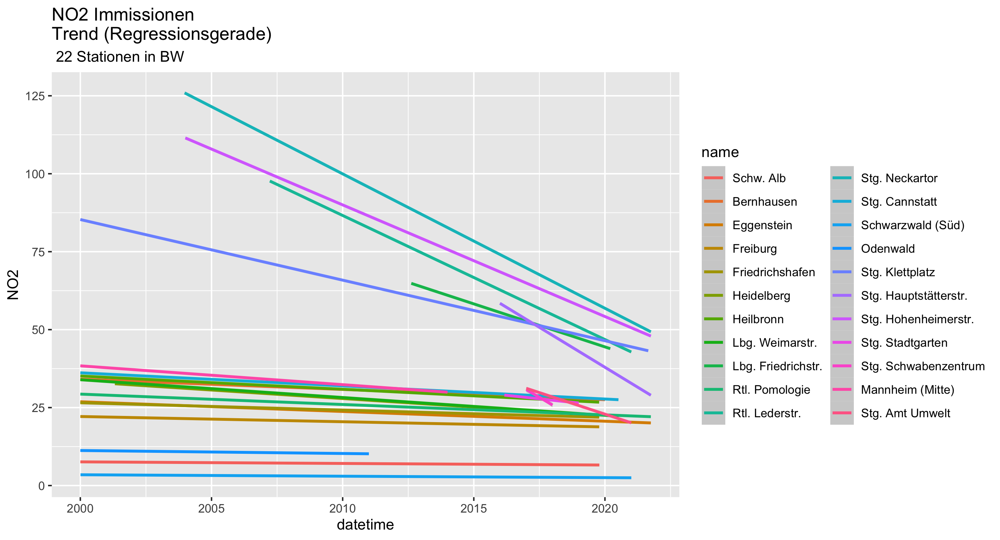

```{r setup, include=FALSE }
knitr::opts_chunk$set(echo = TRUE)
library(tidyverse)
library(knitr)
library(lubridate)
```

## Classification of Immission Measurements in Baden Wuertemberg


```{r echo =FALSE}
BW_Rdat_path<- "~/Documents/Luftqualitaet/Daten/BW_Rdat/"
BW_list_tbl <-readRDS(file.path(BW_Rdat_path,"BW_list_tbl.rds"))
Stationsliste <-readRDS(file.path(BW_Rdat_path,"BW_Stationsliste.rds"))
```
## location  of selected sampling stations
20 sampling stations operated by LUBW (Landesanstalt für Umwelt Baden-Wuerttemberg) have been selected for analysis of concentrations of atmospheric constituents.In addition two stations operated by the "Amt für Umweltschutz" of the city of Stuttgart.

```{r echo = FALSE}
knitr::kable(stationlist)
```

3 sampling stations are located in rural environment,    5 stations located at main streets,    11 sampling urban background immissions.   The stations of the city of Stuttgart are located well above the street level. This has to be observed interpreting the data.   
An overview of the locations:


```{r stations,echo = FALSE}
station.names<-names(BW_list_tbl)# 22 stations
rural.stations<- c("Alb","Odw","Sws")
trafic.stations <- c("Lbg_Friedr","Nck","Rt_leder")
urban.backgrd.stations<- station.names%>% setdiff(c(rural.stations,trafic.stations))
stations<- list(rural= rural.stations,
                urban= urban.backgrd.stations,
                trafic= trafic.stations)
readRDS( file.path(path_Rdat,"Stationsliste.rds"))
```


As an example  1-h mean values, measured at Stuttgart  "Hohenheimer Strasse" at the roadside of a main traffic road "Bundesstrasse 27".   The 1- h means are plotted together with linear regression line over 20 years:


The following should be noted:    
-- the range of measurements covers only less than 6 years 2015-01-01 to 2021-10-01    
-- there is no period with zero 1-h measurements for several month until 2019    
-- as will be seen later the reduction of immissions was very different over time    
-- there are strong outliers, which need interpretation ore exclusion before judged to be critical or not   


```{r echo=FALSE}
comp_detect <- function(df,cmp) {
  exst<- cmp %in% names(df)
  return(exst)
}
BW_mean_NO2<-map_dbl(BW_list_tbl , function(x) ( ifelse (comp_detect(x,"NO2"),
                                                  mean(x$NO2,na.rm=TRUE),NA)))
BW_median_NO2<- map_dbl(BW_list_tbl,function(x) (ifelse (comp_detect (x,"NO2"),
                                                  median(x$NO2,na.rm=TRUE),NA )))
BW_var_NO2 <- map_dbl(BW_list_tbl, function(x) (ifelse (comp_detect (x,"NO2"),
                                                  var(x$NO2,na.rm=TRUE),NA)))
BW_mean_WG <- map_dbl(BW_list_tbl,function(x) (ifelse (comp_detect (x,"WG"),
                                                  mean(x$WG,na.rm=TRUE),NA )))
BW_var_WG <-map_dbl(BW_list_tbl,function(x) (ifelse(comp_detect (x,"WG"),
                                                  var(x$WG,na.rm=TRUE),NA) ))
BW_mean_O3<-map_dbl(BW_list_tbl , function(x) ( ifelse (comp_detect(x,"O3"),
                                                         mean(x$O3,na.rm=TRUE),NA)))
BW_median_O3<- map_dbl(BW_list_tbl,function(x) (ifelse (comp_detect (x,"O3"),
                                                         median(x$O3,na.rm=TRUE),NA )))
BW_var_O3 <- map_dbl(BW_list_tbl, function(x) (ifelse (comp_detect (x,"O3"),
                                                        var(x$O3,na.rm=TRUE),NA)))

BW_statistic <- tibble (Station =  names(BW_list_tbl),
                                NO2_mean=  BW_mean_NO2,
                                NO2_median=BW_median_NO2,
                                NO2_var =  BW_var_NO2,
                                WG_mean =  BW_mean_WG,
                                WG_var =   BW_var_WG,
                                O3_mean =  BW_mean_O3,
                                O3_median= BW_median_O3,
                                O3_var =   BW_var_O3)
```
## Key  immissions data from 22 sampling stations 
```{r echo =FALSE}
BW_statistic%>% arrange(NO2_mean)%>% knitr::kable(digits=1)

```
The table is arranged in ascending order of **mean NO2 immissions measurements** calculated from 1-h measurements  published by LUBW (Landesanstalt für Umwelt Baden Wuerttemberg).    
-- in  rural environment 20 year mean immissions are less than  $10 [μg/m^3]$.  
-- urban background immissions range from $10 [μg/m^3]$ to $30 [μg/m^3]$.    
-- 20-years mean immissions  close to main traffic streets are bigger than $40 [μg/m^3]$.

## linear trends at various stations



This summary view shows 
-- that the average immissions at the three rural stations stay below $10 [μg/m^3]$   
-- at the rural stations the mean values are nearly independent of the time 
-- at a major group of stations (urban background stations) the regression lines are   
   between $25 [μg/m^3]$ and $40 [μg/m^3]$
-- at most of the background stations *rate of reduction is much lower* than with traffic stations     
-- at stations located at streets with heavy traffic the reduction of immissions is very high   
-- initially mean values were above critical limits   
-- at Stuttgart "Am Neckartor" the highest values are recorded     
   --- starting in 2003 with more than $125 [μg/m^3]$     
   --- the longterm "Am Neckartor" trend reaching in 2020  $50 [μg/m^3]$
-- there are some stations where the *rate of reduction* is  higher than at the station Am Neckartor where the 


## rate of immission reductions
```{r echo = FALSE}
ysec<- 60*60*24*365
slp.model <- function (df) {
  cof<-lm(NO2 ~ datetime, data = df)
  slp<-cof$coefficients[2]*ysec
  return(slp)
}
BW_list_tbl$Alb %>% slp.model()
NO2_chg.py<-tibble(Station= names(BW_list_tbl),
                   chg_py=BW_list_tbl%>%map_dbl(~slp.model(.)))%>% arrange(chg_py)
kable(NO2_chg.py,digits =1)

```

The rate of mean yearly reductions ranges from $-5.1[μg/(m^3*y)]$ at the Hauptstätter strasse and no change at all $0 [μg/(m^3*y)]$ at the sampling station Schwarzwald-Süd


