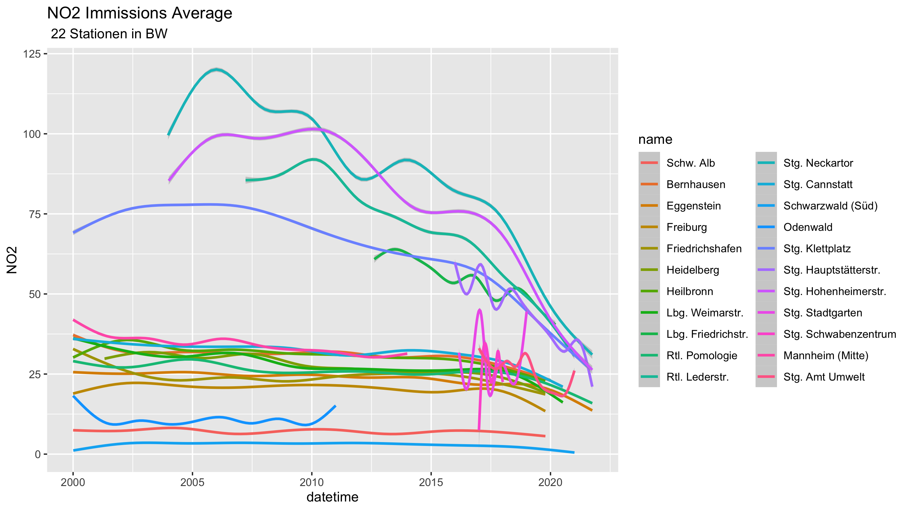

```{r setup, include=FALSE }
knitr::opts_chunk$set(echo = TRUE)
library(tidyverse)
library(knitr)
library(lubridate)
```

## Classification of Immission Measurements 2000 to 2020 in Baden Wuerttemberg
### longterm trends calculated from recordings at sampling stations###

```{r echo =FALSE}
BW_Rdat_path<- "~/Documents/Luftqualitaet/Daten/BW_Rdat/"
BW_list_tbl <-readRDS(file.path(BW_Rdat_path,"BW_list_tbl.rds"))
Stationsliste <-readRDS(file.path(BW_Rdat_path,"Stationsliste.rds"))
```
### location  of selected sampling stations
20 sampling stations operated by LUBW (Landesanstalt für Umwelt Baden-Wuerttemberg) have been selected for analysis of concentrations of atmospheric constituents.In addition 2 stations operated by the city of Stuttgart "Amt für Umweltschutz".

```{r echo = FALSE}
knitr::kable(Stationsliste)
```

3 sampling stations are located in rural environment,    7 stations located at main streets,   10 sampling urban background immissions. In addition 2 stations operated by  the city of Stuttgart one located downtown on top of a building about 20 m above the street level the second at the office building in urban background. 
An overview of the locations:


```{r stations,echo = FALSE}
station.names<-names(BW_list_tbl)# 22 stations
rural.stations<- c("Alb","Odw","Sws")
trafic.stations <- c("Lbg_Friedr","Stg_Nck","Rt_leder","Stg_Hpt","Stg_Hoh","Stg_Klt")
urban.backgrd.stations<- station.names%>% setdiff(c(rural.stations,trafic.stations))
stations<- list(rural= rural.stations,
                urban= urban.backgrd.stations,
                trafic= trafic.stations)
readRDS( file.path(BW_Rdat_path,"Stationsliste.rds"))
```


As example of NO2 1-h mean values, measured at Stuttgart- Bad Cannstatt at the roadside are shown in the plot "NO2-immissions 20 years". The 1- h means are plotted together with red linear regression line over 20 years:


The following should be noted:  
-- the immissions vary annually with maximum in winter month
-- average immissions are reduced with a rate of about $0.4 [μg/m^3]per year$
-- there are long periods without zero 1-h measurements (2016 to 2018) and others reaching zero over longer time periods(2001)
--  outliers indicate a strong variation of the immissions at the location of the sampling instrument

These observations need to be taken into account with interpretation of the data.


```{r echo=FALSE}
comp_detect <- function(df,cmp) {
  exst<- cmp %in% names(df)
  return(exst)
}
BW_mean_NO2<-map_dbl(BW_list_tbl , function(x) ( ifelse (comp_detect(x,"NO2"),
                                                  mean(x$NO2,na.rm=TRUE),NA)))
BW_median_NO2<- map_dbl(BW_list_tbl,function(x) (ifelse (comp_detect (x,"NO2"),
                                                  median(x$NO2,na.rm=TRUE),NA )))
BW_var_NO2 <- map_dbl(BW_list_tbl, function(x) (ifelse (comp_detect (x,"NO2"),
                                                  var(x$NO2,na.rm=TRUE),NA)))
BW_mean_WG <- map_dbl(BW_list_tbl,function(x) (ifelse (comp_detect (x,"WG"),
                                                  mean(x$WG,na.rm=TRUE),NA )))
BW_var_WG <-map_dbl(BW_list_tbl,function(x) (ifelse(comp_detect (x,"WG"),
                                                  var(x$WG,na.rm=TRUE),NA) ))
BW_mean_O3<-map_dbl(BW_list_tbl , function(x) ( ifelse (comp_detect(x,"O3"),
                                                         mean(x$O3,na.rm=TRUE),NA)))
BW_median_O3<- map_dbl(BW_list_tbl,function(x) (ifelse (comp_detect (x,"O3"),
                                                         median(x$O3,na.rm=TRUE),NA )))
BW_var_O3 <- map_dbl(BW_list_tbl, function(x) (ifelse (comp_detect (x,"O3"),
                                                        var(x$O3,na.rm=TRUE),NA)))

BW_statistic <- tibble (Station =  names(BW_list_tbl),
                                NO2_mean=  BW_mean_NO2,
                                NO2_median=BW_median_NO2,
                                NO2_var =  BW_var_NO2,
                                WG_mean =  BW_mean_WG,
                                WG_var =   BW_var_WG,
                                O3_mean =  BW_mean_O3,
                                O3_median= BW_median_O3,
                                O3_var =   BW_var_O3)
```
## Key  immissions data from 23 sampling stations 

Mean values, variance and median of $NO_2$ and $O_3$ concentrations are very different for the 22 stations analyzed: 

```{r echo =FALSE}
BW_statistic%>% arrange(NO2_mean)%>% knitr::kable(digits=1)

```
The table is arranged in ascending order of **mean NO2 immissions measurements** calculated from 1-h measurements  recorded and published by LUBW (Landesanstalt für Umwelt Baden Wuerttemberg). The mean calculated on the 20 year interval of all recorded data.   
--in **rural** environment  immissions are less than  **$10 [μg/m^3]$**.  
--**urban background** immissions range from **$10 [μg/m^3]$ to $30 [μg/m^3]$**.    
--immissions  close to **main traffic** streets are bigger than **$40 [μg/m^3]$**.

## linear trends of immissions at sampling stations


This summary view shows 
-- that the average immissions at the three rural stations stay **below $10 [μg/m^3]$**  
-- at the rural stations the mean values are nearly independent of the time 
-- at a major group of urban background stations the regression lines (20 year mean)  
   are located higher than $25 [μg/m^3]$ and lower $40 [μg/m^3]$
-- at most of the background stations *rate of reduction is much lower* than with traffic stations     
-- at stations located at main streets (heavy traffic) the reduction of immissions per year is high   
-- 20-year mean values at main streets exceeded limits considered dangerous to human health  
-- at Stuttgart "Am Neckartor" the highest values were recorded     
   --- starting in 2003 with anual mean greater $125 [μg/m^3]$     
   --- with long term reductions "Am Neckartor"  reaching  $50 [μg/m^3]$in 2020 
-- at some stations the *rate of reduction (chg_py)* is  higher than at the station "Am Neckartor"


## rate of immission reductions
```{r echo = FALSE}
ysec<- 60*60*24*365
slp.model <- function (df) {
  cof<-lm(NO2 ~ datetime, data = df)
  slp<-cof$coefficients[2]*ysec
  return(slp)
}
BW_list_tbl$Alb %>% slp.model()
NO2_chg.py<-tibble(Station= names(BW_list_tbl),
                   chg_py=BW_list_tbl%>%map_dbl(~slp.model(.)))%>% arrange(chg_py)
kable(NO2_chg.py,digits =1)

```

The  mean yearly reductions ranges from $-5.1[μg/(m^3*y)]$ at the "Hauptstätter Strasse" and no change at all $0 [μg/(m^3*y)]$ at the sampling station "Schwarzwald-Süd"


## monthly variations of immissions

Smoothed values of NO2 immissions at "Stuttgart Am Neckartor" **increased from 2004 to 2005** with a sharp decrease following, which was interrupted in 2010 followed by a strong decrease. 
All urban sampling stations recorded a strong reduction of immissions around 2015/2016. Some exceptions may be related to changing local conditions as vehicle speed limits were imposed or emissions increase locally from heavy-duty machinery (construction work for Stuttgart 21). The increased emissions  effected the immissions at the nearby sampling station __Stg. Klettplatz__ and  __Stg. Am Neckartor__.





## Comparison  with emission data


The graph shows the emissions reported to or calculated by the German Umweltbundesamt (UBA). The regression lines the average reduction of total emissions and the contribution of transport and road transport. The main reason for the reduction of transport emissions were improvements were progress with combustion engines and intensive treatment of exhaust gases at power plants and industry. the latter took place mainly 2000 to 2005.

