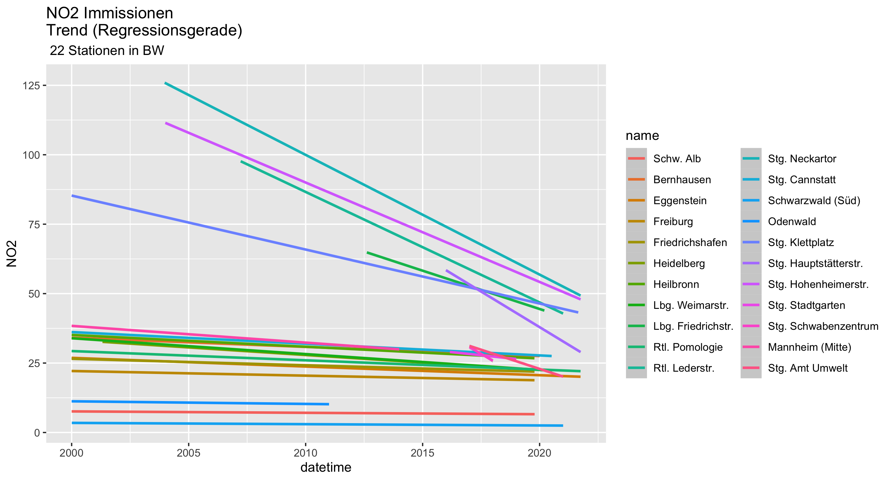
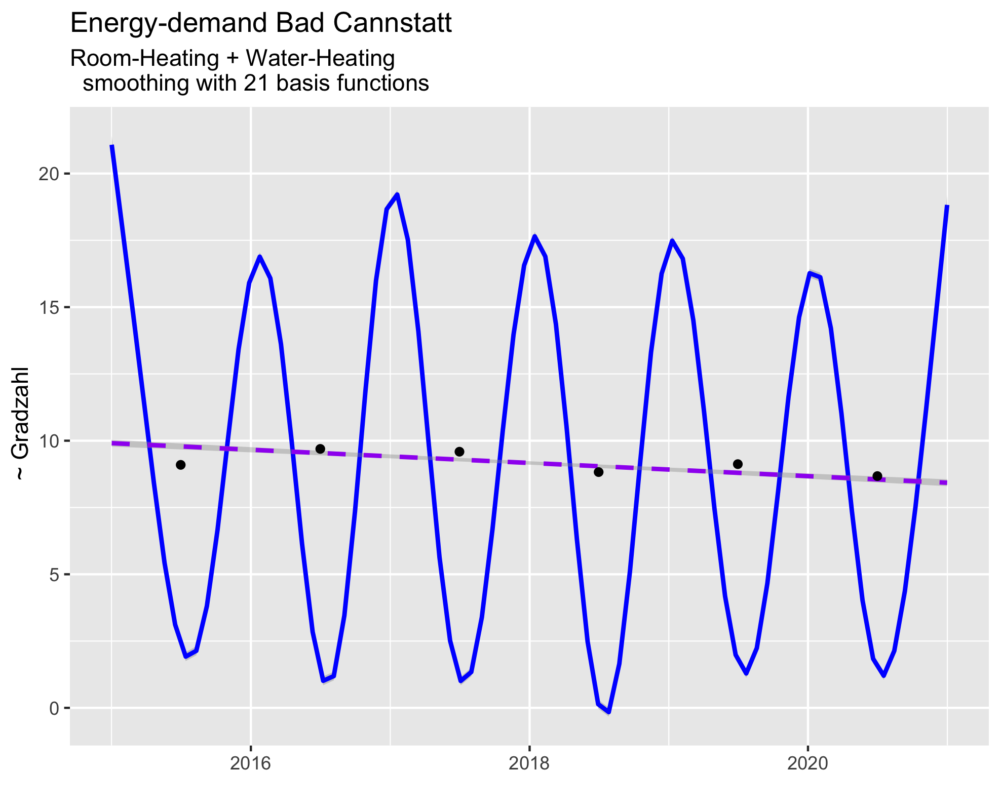
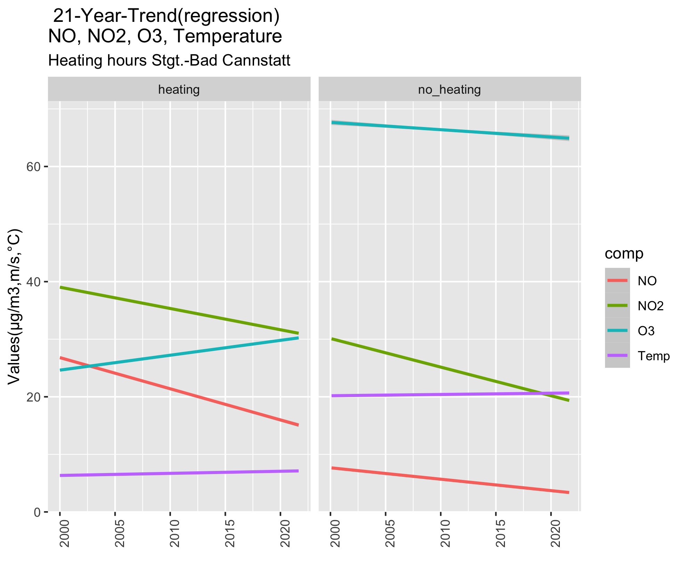
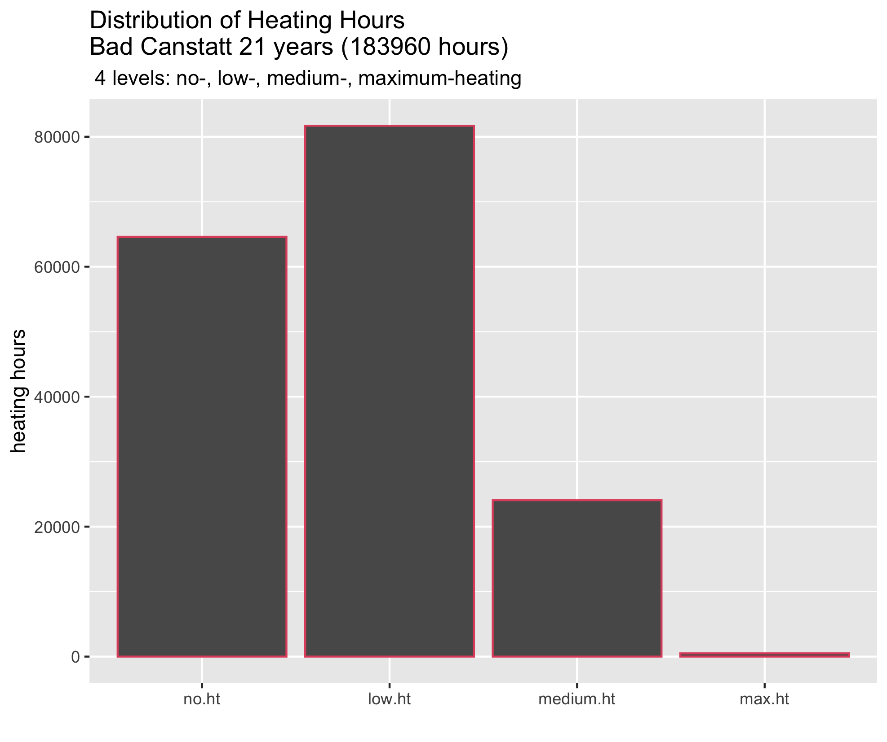

```{r setup, include=FALSE }
knitr::opts_chunk$set(echo = TRUE)
library(tidyverse)
library(knitr)
library(lubridate)
save.figs <- paste0("~/projects/StationsClassification","/reports/figs")
```

## Classification of Immission Measurements 2000 to 2020 in Baden Wuerttemberg ##
### Longterm trends calculated from recordings at sampling stations###


The objective of this study is to understand the systematic dependence of the concentrations **imissions** of  atmospheric gases on emissions from various sources:  
-- motor vehicles,
-- house heating,   
-- power-plants,   
-- industrial processes        
and the variation of environmental parameters:   
-- temperature,    
-- solar irradiation (radiation balance),   
-- humidity 
-- wind speed and direction  
   
and their **interactions**. 

Environmental data are measured at 99  sampling stations in Baden - Württemberg by LUBW: **Landesanstalt für Umwelt Baden-Württemberg**. 
To understand the effects of human emissions on the immissions, the dependence of  location and the interaction with natural atmospheric components  stations have been selected which are representative.

```{r echo =FALSE}
BW_Rdat_path<- "~/Documents/Luftqualitaet/Daten/BW_Rdat/"
BW_list_tbl <-readRDS(file.path(BW_Rdat_path,"BW_list_tbl.rds"))
Stationsliste <-readRDS(file.path(BW_Rdat_path,"Stationsliste.rds"))
```

### Location  of selected sampling stations


Time series of data used for  may be downloaded from  url:"https://https://udo.lubw.baden-wuerttemberg.de/public". Thes were supplemented with data from 2 stations operated by the city of Stuttgart "Amt für Umweltschutz".

```{r echo = FALSE}
knitr::kable(Stationsliste)
station_url<-"https://udo.lubw.baden-wuerttemberg.de/public"
#browseURL(station_url)
```

To cover the varying conditions of the  air-quality 4 groups are evaluated:

--  3 sampling stations are located in rural environment,   
--  7 stations located at main streets,   
--  10 sampling urban background immissions   
--  the 2 stations operated by  the city of Stuttgart are located downtown on top of a building about 20 m above the street level the second at the office building.   

The positions are shown in the map derived from Google Maps:


```{r stations,echo = FALSE}
station.names<-names(BW_list_tbl)# 22 stations
rural.stations<- c("Alb","Odw","Sws")
trafic.stations <- c("Lbg_Friedr","Stg_Nck","Rt_leder","Stg_Hpt","Stg_Hoh","Stg_Klt")
urban.backgrd.stations<- station.names%>% setdiff(c(rural.stations,trafic.stations))
stations<- list(rural= rural.stations,
                urban= urban.backgrd.stations,
                trafic= trafic.stations)
readRDS( file.path(BW_Rdat_path,"Stationsliste.rds"))
```


NO2 1-h time series, measured at Stuttgart- Bad Cannstatt at urban background are shown in the plot "NO2-immissions 20 years". The data exhibit a systematic reduction and  suggest periodic dependencies. The data are poised by stochastic effects as illustrated with the dots (each representing a  1- h mean). To determine systematic dependencies models are need to describe the measured 1-h data. A  model to describe the trend of the Cannstatt immission is the linear regression (red line) calculated from 21 years measurements.  In addition an  annual variation with high values during winter time and low values during the summer month is suggested with the plot:


#### Some first observations with the Bad- Cannstatt data:###

--  the immissions vary annually with maximum in winter month  
--  average immissions are  reduced at a rate of $0.4 [μg/m^3]per year$  
--  outliers indicate a strong variation of the immissions (or may be  instability of the instruments)   

## Comparison of stations ##
```{r echo=FALSE}
comp_detect <- function(df,cmp) {
  exst<- cmp %in% names(df)
  return(exst)
}
BW_mean_NO2<-map_dbl(BW_list_tbl , function(x) ( ifelse (comp_detect(x,"NO2"),mean(x$NO2,na.rm=TRUE),NA)))
BW_var_NO2 <- map_dbl(BW_list_tbl, function(x) (ifelse (comp_detect(x,"NO2"),var(x$NO2,na.rm=TRUE),NA)))
BW_mean_NO<-map_dbl(BW_list_tbl , function(x) ( ifelse (comp_detect(x,"NO"),mean(x$NO,na.rm=TRUE),NA)))
BW_var_NO <- map_dbl(BW_list_tbl, function(x) (ifelse (comp_detect(x,"NO"),var(x$NO,na.rm=TRUE),NA)))
BW_mean_WG <- map_dbl(BW_list_tbl,function(x) (ifelse 
(comp_detect (x,"WG"),mean(x$WG,na.rm=TRUE),NA )))
BW_var_WG <-map_dbl(BW_list_tbl,function(x) (ifelse
(comp_detect (x,"WG"),var(x$WG,na.rm=TRUE),NA) ))
BW_mean_O3<-map_dbl(BW_list_tbl , function(x) ( ifelse 
(comp_detect(x,"O3"),mean(x$O3,na.rm=TRUE),NA)))
BW_var_O3 <- map_dbl(BW_list_tbl, function(x) (ifelse 
(comp_detect (x,"O3"),var(x$O3,na.rm=TRUE),NA)))

BW_statistic <- tibble (Station =  names(BW_list_tbl),
                                NO2_mean=  BW_mean_NO2,
                                NO2_var =  BW_var_NO2,
                                WG_mean =  BW_mean_WG,
                                WG_var =   BW_var_WG,
                                O3_mean =  BW_mean_O3,
                                O3_var =   BW_var_O3)
```
## Key  immission data from 23 sampling stations ##

Mean and variance of $NO_2$,$O_3$:  

--  21 year means  of $NO_2$ are smaller  than $10[μg/m^3]$at **rural stations**    and exceed $40[μg/m^3]$ close to **main streets**     
-- **urban background** immissions range from **$10 [μg/m^3]$ to $30 [μg/m^3]$**.   
--  $O_3$ concentrations seem to independent of traffic emissions 

```{r echo =FALSE}
BW_statistic%>% arrange(NO2_mean)%>% knitr::kable(digits=1)

```


### Linear trends of immissions at sampling stations###





Observations from the linear trend :
-- average immissions at the three rural stations are **less than $10 [μg/m^3]$**  
-- at the rural stations the mean ** $mean  NO_2 $ ** values are  independent of time 
-- the negative slope of regression lines (21 year mean) from stations located in urban background  
-- at most of urban background stations **rate of reduction (chg_py) ** of $mean  NO_2 $ ** is low** compared  with traffic stations     
-- at main streets (heavy traffic) big  **reduction per year** of $mean  NO_2 $    
-- 20-year $mean  NO_2 $ exceeded **limits considered dangerous** to human health **close to main streets**
-- at Stuttgart "Am Neckartor" the maximum $mean NO_2 $ was recorded     
   --- starting in 2003 with annual mean greater $125 [μg/m^3]$ which was reduced to $50 [μg/m^3]$in 2020    
   ---  2020 and later the long time trend "Am Neckartor"  indicates levels smaller $40 [μg/m^3]$
-- at some stations the *rate of reduction (chg_py)* is  higher than at the station "Am Neckartor"


### More details to distinguish rural, urban and traffic immission

Selecting 3 typical NO2- sampling station one located in *rural environment (Schwarzwald Süd)* , a second measuring  *urban background (Stuttgart Bad-Cannstatt)* and a third at roadside of a *main street (Ludwigsburg Friedrichstrasse)* shows the different trends (slope) of averaged immission. 


### Rate of immission reductions
```{r echo = FALSE}
ysec<- 60*60*24*365
slp.model <- function (df) {
  cof<-lm(NO2 ~ datetime, data = df)
  slp<-cof$coefficients[2]*ysec
  return(slp)
}
BW_list_tbl$Alb %>% slp.model()
NO2_chg.py<-tibble(Station= names(BW_list_tbl),
                   chg_py=BW_list_tbl%>%map_dbl(~slp.model(.)))%>% arrange(chg_py)
kable(NO2_chg.py,digits =1)

```

Mean yearly reductions(chg_py) range from $-5.1[μg/(m^3*y)]$ at the "Hauptstätter Strasse" and  $0 [μg/(m^3*y)]$ at the rural background  station "Schwarzwald-Süd".


### Effect of Heating on $NO_2, NO, O_3 ###

### Mean Temperatures
Temperatures vary within a wide range. To interpret the dependence of immissions on temperatures a various models may be suitable. 
-- arithmetic means of 8760 measurements made within calendar year (black dots)
-- regression line of the 1-h measurements covering 21 years
-- fitting the  21 years data with  5 gaussian functions 
-- fitting the  21 years data with  10 gaussian functions

Interpretation of immission-dependencies does depend on the selected model.
The simplest model is the regression line as reference. It is defined by two parameters: **intersect** and **slope**
Two other models have been fitted to the data using gaussian splines taking 5 or 10 parameters to obtain the most likely fit.
A fourth model may be constructed from the following observations:
At temperatures **above 15 C no heating** is necessary. At Temperatures **lower 15 C ** heating is necessary causing **$NO_2$-emissions** by burning fossile fuel.This can be used to determine the effect of house heating on measured immissions.
Comparing the linear regression  at hours with no heating (red line) to hours with heating (green line). The plot of the data measured at Bad Cannstatt shows that about $10 [μg/m^3]$ of immissions are caused by burning fuels to keep rooms at temperature. 


Temperature and or heating does have effects on other atmospheric components also. The linear trends of NO2, NO immission and O3 concentrations measured at Stuttgart Bad-Cannstatt are shown for the two conditions heating / no heating with the following plot:
```{r, echo=TRUE}
dat_path = "/Users/alfloeffler/Documents/Luftqualitaet/Daten/BW_Rdat"

load(file.path(dat_path,"BW.RData"))
summary(BW.all_data)
Can_data<-BW.all_data$Stg.Can$Stg.Can.no2 %>% left_join(BW.all_data$Stg.Can$Stg.Can.no)
Can_data<-Can_data%>% left_join(BW.all_data$Stg.Can$Stg.Can.temp)
Can_data<-Can_data%>%left_join(BW.all_data$Stg.Can$Stg.Can.o3)
Can_data_list<-BW.all_data$Stg.Can
Can_comps<-names(BW.all_data$Stg.Can)
length(Can_comps) #8
Can_tbl<- BW.all_data$Stg.Can$Stg.Can.no2%>% dplyr::select(-NO2)
for (i  in seq_along(BW.all_data$Stg.Can)) {
  df <- BW.all_data$Stg.Can[[i]]
  Can_tbl <- left_join(Can_tbl,df, by=c("station", "datetime"))
}
Can_tbl<-Can_tbl%>% mutate(Hzg = as_factor(ifelse(Temp<= 15,"heating", "no_heating")))
comps <- names(Can_tbl)%>%setdiff(c("station","datetime","Hzg"))
Can_tidy<- Can_tbl%>% pivot_longer(cols = all_of(comps),names_to = "comp",values_to =   "value" )
# Plot
Can_tidy %>% na.omit()%>% filter(comp!= "WR"& comp != "WG"& comp != "CO"& comp != "SO2") %>%
  ggplot(aes(x = datetime))+
  geom_smooth(method = "lm",mapping = aes(y= value,col= comp))+
  facet_grid(.~Hzg)+
  theme(axis.text.x = element_text(angle = 90, hjust = 1))+
  ggtitle(" 21-Year-Trend(regression)
NO, NO2, O3, Temperature",
          subtitle = "Heating hours Stgt.-Bad Cannstatt")+
  labs(x= "", y = "Values(μg/m3,m/s,°C)")
ggsave("Heating_effects.png",path= save.figs)
```


Heating does have an annual periodicity which can be filtered and visualized with 21 gaussian smoothing functions with the aid of  gam- smoothing. An algorithm first published by S. Wood (Wood, S.N. (2003) Thin plate regression splines. J.R.Statist.Soc.B 65(1):95-114) and implemented in R (https://www.rdocumentation.org/packages/mgcv/versions/1.8-38/topics/gam)
The implementation in R is based on Markofchains and a Monte Carlo method (mgcv).
```{r,referencedoc}
url_wood<- "https://www.rdocumentation.org/packages/mgcv/versions/1.8-38/topics/gam"
browseURL(url_wood)

```

Filtering a years period of the NO2-1-h data sampled at Bad Cannstatt () 2015 to 2020 from data previously used) shows the regular periodicity of the energy needed for room heating. With a mean of about $10 [μg/m^3]$ as already found by regression analysis.




Comparing the trends of NO immissions and O3 concentrations from 2000 to 2021 shows, that O3 concentrations are three times higher at times with no heating compared to heating hours and NO immission are close to zero at  temperatures greater 15 C (no heating)


## Interaction of atmospheric components



```{r}
dat_path<- "~/documents/Luftqualitaet/Daten/BW_Rdat"
load(file.path(dat_path,"BW.RData"))
summary(BW.all_data)
Can_data<-BW.all_data$Stg.Can$Stg.Can.no2 %>% left_join(BW.all_data$Stg.Can$Stg.Can.no)
Can_data<-Can_data%>% left_join(BW.all_data$Stg.Can$Stg.Can.temp)
Can_data<-Can_data%>%left_join(BW.all_data$Stg.Can$Stg.Can.o3)
Can_data_list<-BW.all_data$Stg.Can
Can_comps<-names(BW.all_data$Stg.Can)
length(Can_comps) #8
Can_tbl<- BW.all_data$Stg.Can$Stg.Can.no2%>% dplyr::select(-NO2)
for (i  in seq_along(BW.all_data$Stg.Can)) {
  df <- BW.all_data$Stg.Can[[i]]
  Can_tbl <- left_join(Can_tbl,df, by=c("station", "datetime"))
}
Can_tbl<-Can_tbl%>% mutate(Hzg = as_factor(ifelse(Temp<= 15,"heating", "no_heating")))
comps <- names(Can_tbl)%>%setdiff(c("station","datetime","Hzg"))
Can_tidy<- Can_tbl%>% pivot_longer(cols = all_of(comps),names_to = "comp",values_to =   "value" )
# Plot
Can_tidy %>% na.omit()%>% filter(comp!= "WR"& comp != "WG"& comp != "CO"& comp != "SO2") %>%
  ggplot(aes(x = datetime))+
  geom_smooth(method = "lm",mapping = aes(y= value,col= comp))+
  facet_grid(.~Hzg)+
  theme(axis.text.x = element_text(angle = 90, hjust = 1))+
  ggtitle(" 21-Year-Trend(regression)
NO, NO2, O3, Temperature",
          subtitle = "Heating hours Stgt.-Bad Cannstatt")+
  labs(x= "", y = "Values(μg/m3,m/s,°C)")
```


## distribution of heating hours
To visualize the effect of energy burned to heat individual homes, offices and public buildings the demand of heating expressed by the temperature difference $Grdz =  20- Temp  [°C]$ Room temperature an outside Temperature is classified into 4 groups: 
-  no heating necessary $no.ht$  
-  low heating $low.ht$   
-  medium heating $medium.ht$
-  maximum heating $max.ht$ 

Within 21 years (183960 hours) about one third ~ 60000 hours no heating was necessary, low energy consumption was necessary at about 80000 hours, medium with ~ 20000 hours and maximum only for a very small number of hours.



## Comparison  with emission data


The graph shows the emissions reported to or calculated by the German Umweltbundesamt (UBA). The regression lines the average reduction of total emissions and the contribution of transport and road transport. The main reason for the reduction of transport emissions were improvements were progress with combustion engines and intensive treatment of exhaust gases at power plants and industry. the latter took place mainly 2000 to 2005.

