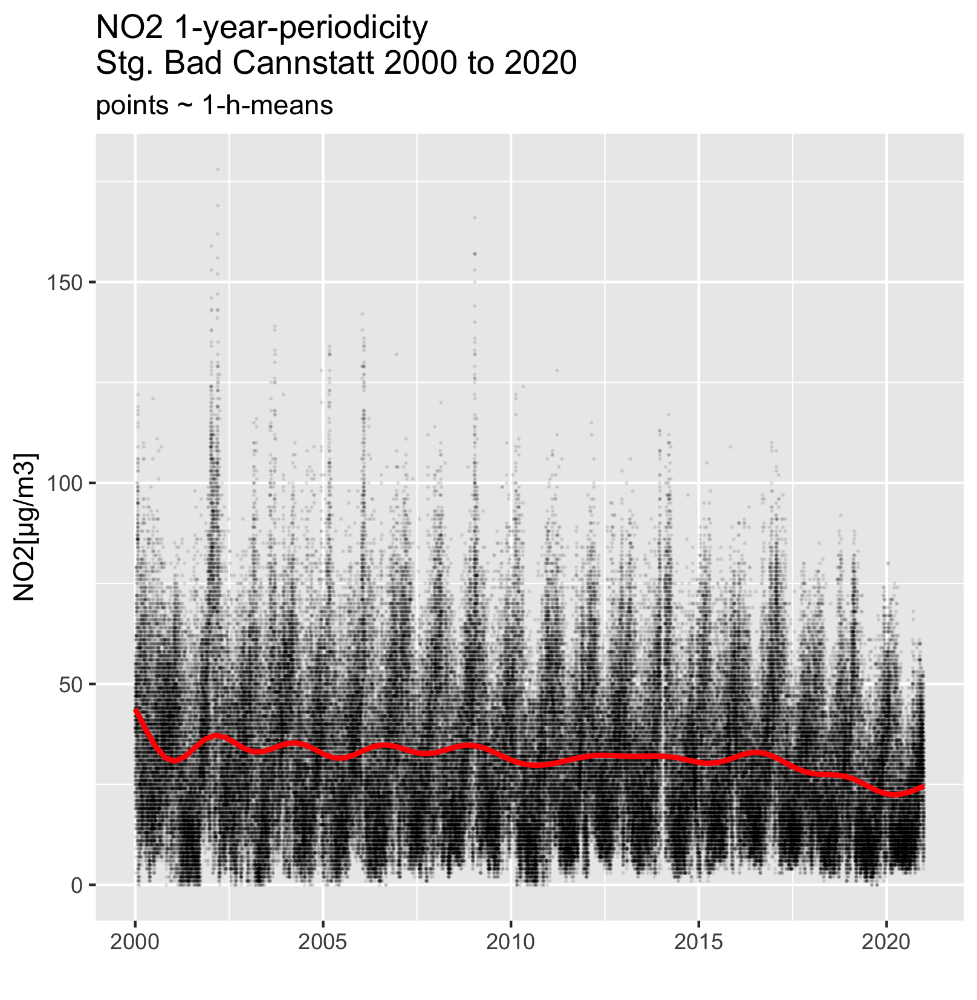

```{r setup, include=FALSE}
knitr::opts_chunk$set(echo = TRUE)
library(tidyverse)
library(lubridate)
dat_path = "/Users/alfloeffler/Documents/Luftqualitaet/Daten/BW_Rdat"
BW_list_tbl<-readRDS(file.path(dat_path,"BW_list_tbl.rds"))
Can_dat<- BW_list_tbl$Stg_Can%>% subset(datetime< ymd("2021-01-01"))
```

## Classification of Immission Measurements 2000 to 2020 in Baden-Wuerttemberg(BW)
### Periodicity  of recorded data ###

The distribution of immissions depends on  many factors:

 * the time and intensity of operations,
 * the location of the emission sources, 
 * the interaction of the atmospheric components and 
 * the effect of wind speed and direction on the dilution

A summary of state of the art calculation  and simulation methods (Stand der Modellierungstechnik zur Prognose der NO2-Konzentrationen in Luftreinhalteplänen nach der 39. BImSchV) was published by the Umweltbundesamt and is available from [Stand Modellierung UBA](http://www.uba.de/uba-info-medien/4191.html)


### Location of emission sources

Exhaust gas from motor vehicles is emitted to a large extend along main routes (Autobahn, Bundesstrassen, Hauptstrassen).Statistics show, that about 50% are emitted outside urban area. Fuel burned for heating results in emissions spreads within settled areas. Power plants  are located at a few points in BW. As their chimneys are high the exhaust gas is to some extend diluted when it reaches populated areas. Industrial emissions are mainly some distance off  settled areas.

### Time dependence of emissions
>
> Emitters don't work at constant rate at various times. Some patterns as examples: 
>
> * Burning fuel to heat  is  necessary if temperatures are less than 15 C. Automated house-heating-systems are controlled by outside temperature to keep room temperatures at ~ 20 C . Therefore  exhaust emissions are proportional to $(20  - Temp)$
> * traffic with passenger cars is different at working days and weekends.  
>This can be verified by analyzing the dependence of immissions at selected days of the week or hours of a day or combination of both  


### Windeffects

>If the source of emissions (e.g. a power plant) is located in the  direction of winds, the immissions depend on wind direction.   
>The windrose measured at the sampling station Reutlingen show sensitivity to emissions from the sector 105° to 135° and 225° to 255°  which are the main wind directions.    
>Strong winds transport emissions over greater distance. The dependence of immission on the wind force and distance can be used to identify   immission sources.    


## Pattern recognition in extended time series of measurements
In the first part of this publication we did show the long term trends of NO2-immissions at selected stations taking samples in urban and rural environments and how the trends depend on the long term trends of emission sources.   


With this part we show how the periodic variation **monthly(or calendar week), day of the week, hour of the day**  of emissions are related to immission variation at the sampling stations. This correlations can be used to identify the contributions of the various emissions sources to the measured immissions.

As an example of urban immissions we selected the station an Stuttgart Bad Cannstatt (ID 4452). 
To get a first impression on the  periodic variations the 1-h-mean-NO2-immissions the 1-values are plotted as black points together with a smoothing function ( red line). This smoothing function is a linear combination of 21 basis functions the parameters calculated using a maximum likelihood method. The plot shows that the immissions are very high during winter time (1 peak every year) and low during the summer month.The smoothing red line however does not show the same number of peaks. The difference will be investigated later



 
 
The 1-h measurements at this station located in a typical urban area at the side of a major road and surrounded by family and  apartment houses.  Local emissions result from burning processes: motor-vehicles, house heating, waste treatment, a power station burning gas  and industrial activities (motor engine test facility): 
 - **fossil fuel burned** 
 
    > for heating and warming water,     
 - **vehicle exhaust**,  
 - **power plants**,   
 - **waste treatment**  
 - **industrial processes** 

## Effects of heating on urban immissions

To model the effect of house heating on emissions it is necessary to understand the control of house-heating systems.
Automated heating shall keep temperatures at living rooms at about  20 C. The energy needed to compensate for the heat loss through walls,  windows, ceiling and ventilation depends on the  outside temperatures (Temp). It is proportional to the temperature difference (Grdz). Hence the emissions from burning fossil fuels are proportional to $Grdz = (20 - Temp)*perc.time$.Heat inside the rooms is dissipated  also from lighting, cooking, machinery, computers, etc. This dissipated heat is for an average 3 family household in the order of 3000 kWh per year. 
Because of this dissipated  heat the direct heating is only necessary at outside temperatures below 15 C.

```{r Heizg , include=FALSE}
HeizDaten_Can <-Can_dat%>% filter (Temp < 15) %>%
  summarise (Gesamt.std =NROW(Can_dat)   ,Hzg.std = n()  ,perc.time = Hzg.std / NROW(Can_dat)*100,
             Temp.avg  =mean(Temp, na.rm = TRUE),
             Grdz= (20-Temp.avg)*perc.time/100)

```

```{r, echo=FALSE}
knitr::kable (HeizDaten_Can,digits =1,align= "c")
```


## Emissions from fuel burned for heating

# 20 years mean values


A first view on the temperature data recorded from 2000 to 2020 shows:

* 184103 1-h-averages of temperatures were recorded  
* heating was necessary for 121404 h that is 69.7% of time 
* the average temperature calculated from the 1- values was 6.7 C and   
* the fuel burned for heating proportional to 8.8 plus 20% for warming water 
* the scale factor of fossil burned fuel to NO2 immission has to be determined

Heating bills of apartments show that about 20% of the fuel- burned for keeping the temperature of the rooms is needed for heating water.  


# Anual data
```{r, echo =FALSE}

Can_dat<- Can_dat %>% 
  mutate(Yr = as.integer(format(datetime,format= "%Y")),Yr = as_factor(Yr))
Can_dat_Yr <-Can_dat%>% subset(datetime< ymd("2021-01-01"))%>%
  group_by(Yr) %>% summarise (station=first(name),
                                                      datetime = first(datetime), 
                                                      T_Jahr_mittel= mean(Temp,na.rm= TRUE),
                                                      NO2_Jahr_mittel= mean(NO2,na.rm=TRUE),
                                                      Hz_energ_bedarf= (20-T_Jahr_mittel)*1.20)
Can_dat_Yr %>% 
  subset(datetime <= ymd("2020-12-31"))%>%
  ggplot(aes(x = Yr, y=Hz_energ_bedarf))+
        geom_point(col = "red")+
        geom_smooth(data=Can_dat_Yr,
             method = "gam",mapping= aes(x =as.numeric(Yr) , y=Hz_energ_bedarf),
             col = "red", formula = y~ s(x, k = 20) )+
        geom_smooth(data=Can_dat_Yr,
              method = "lm",mapping= aes(x =as.numeric(Yr) , y=Hz_energ_bedarf),
              col = "purple", formula = y~ x ,linetype = 2)+
        ggtitle("Heating-Energy Bad Cannstatt",
          subtitle = "Year-average_Heating + 
   20% Water-Heating")+
  labs(y= "~ Grdz(Jahr)", x = "")+
  theme(axis.text.x = element_text(angle = 90, hjust = 1))
ggsave("Hzg_NO2_Can.png",device="png",path="~/projects/StationsClassification/reports/figs")
```


## Variations of Temperature, NO2/NO-Immissions as a Function of Month of a Year


The fig shows as regression line the  general trend to lower heating demands. But with considerable year to year changes.The smoothing line fitting the annual data does not show this variation properly because of a too small number of basis functions.


## Variation per calendar week
