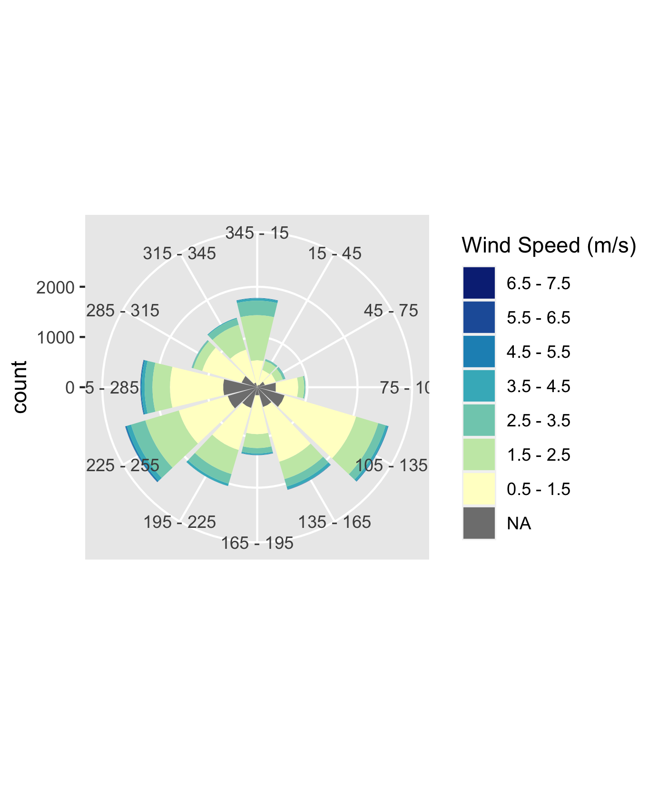
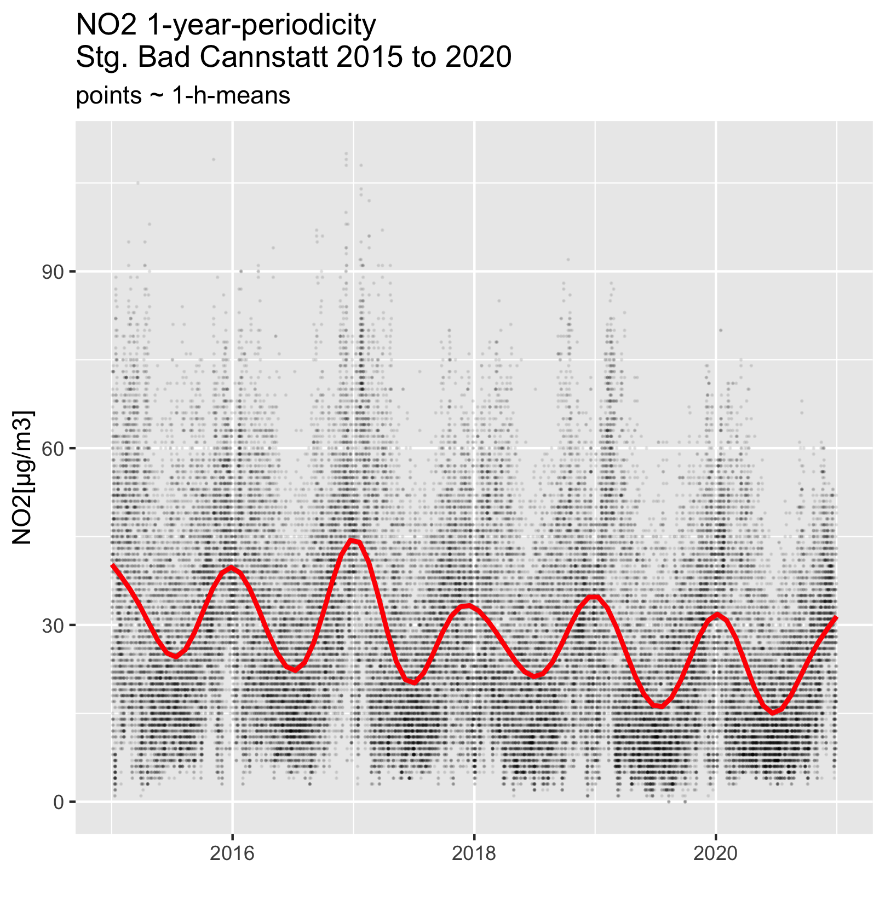
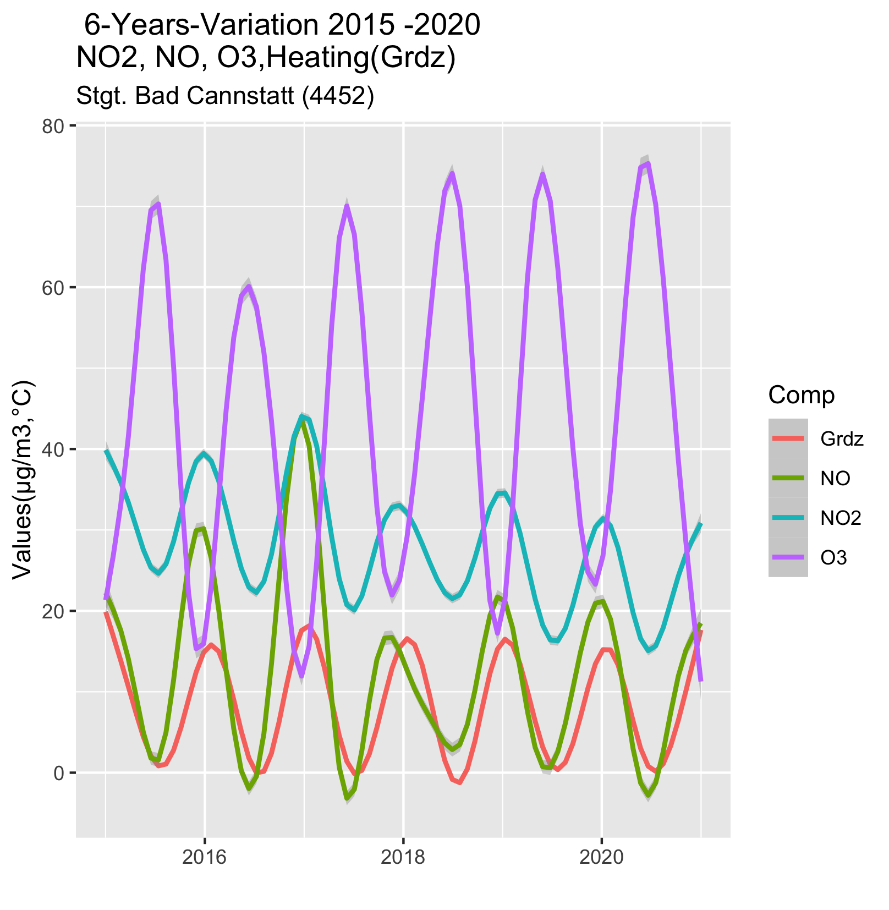
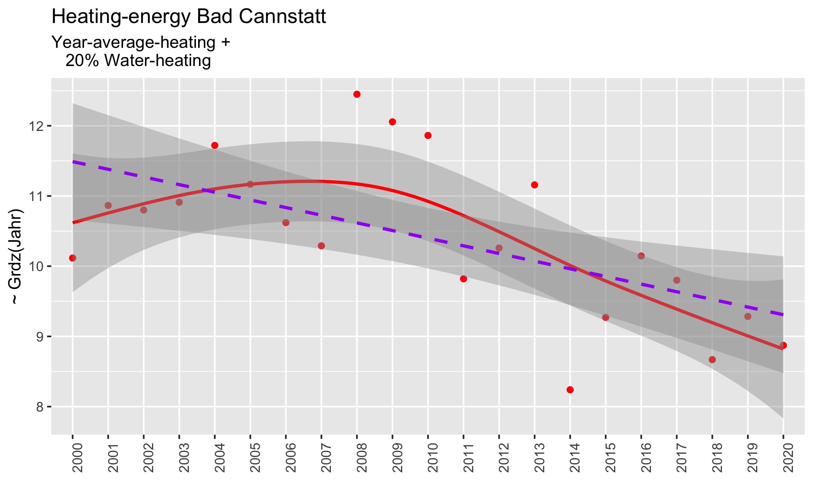
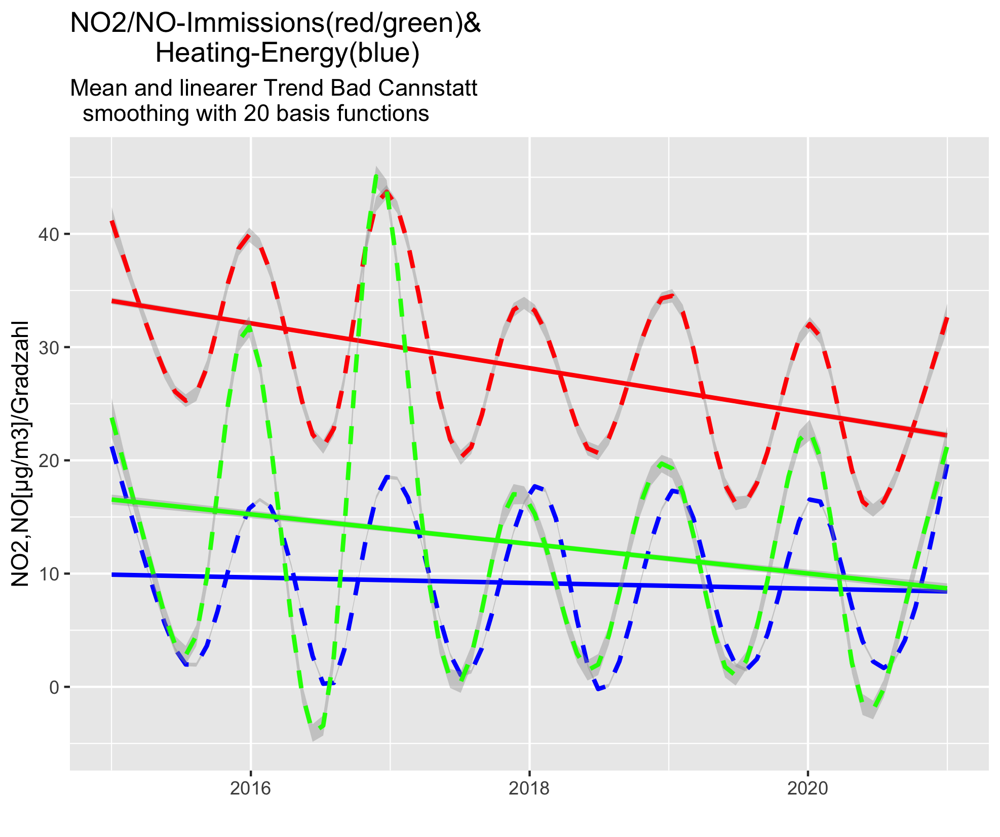

```{r setup, include=FALSE}
knitr::opts_chunk$set(echo = TRUE)
library(tidyverse)
library(lubridate)
dat_path = "/Users/alfloeffler/Documents/Luftqualitaet/Daten/BW_Rdat"
BW_list_tbl<-readRDS(file.path(dat_path,"BW_list_tbl.rds"))
Can_dat<- BW_list_tbl$Stg_Can%>% subset(datetime< ymd("2021-01-01"))
```

## Classification of Immission Data 2000 to 2020 in Baden-Wuerttemberg(BW)
### Periodicity  of recorded data ###


The distribution immissions caused by emissions depends on  many factors :

 * the time and intensity of operations,
 * the location of the emission sources, 
 * the interaction of the atmospheric components and 
 * the effect of wind speed and direction on the dilution

A summary of state of art  methods to determine the effects was published by the German Umweltbundesamt: Stand der Modellierungstechnik zur Prognose der NO2-Konzentrationen in Luftreinhalteplänen nach der 39. BImSchV. The report is available from [Stand Modellierung UBA](http://www.uba.de/uba-info-medien/4191.html)


### Location and characteristic of mayor emission sources

Exhaust gas from motor vehicles is emitted  along *main routes (Autobahn, Bundesstrassen, Hauptstrassen)*. About 50% of road traffic exhaust is emitted outside urban areas. Fuel burned for *heating causes emissions* spreads within *settled areas only*. The exhaust gases of *Power plants* and *waste treatment* are generally reduced by  *flu gas scrubbing*. As the exhaust is emitted by high chimneys, the gases  are diluted until they reach populated areas. *Industrial emissions* are mostly off settled areas and treated before entering the atmosphere.

### Time dependence of emissions
>
> Emitters don't work at constant rate at various times. Some patterns as examples: 
>
> * Burning fuel to heat  is  necessary if temperatures are less than 15 C. Automated house-heating-systems are controlled by outside temperature to keep room temperatures at ~ 20 C . Therefore  exhaust emissions are proportional to $(20  - Temp)$
> * traffic with passenger cars is different at working days and weekends.  
>This can be verified by analyzing the dependence of immissions at selected days of the week or hours of a day or combination of both   
>
> * many industrial emissions are strongly reduced at weekends and holidays


### Windeffects

>If the source of emissions (e.g. a power plant) is located in the  direction of winds, the immissions depend on wind direction.   
>The windrose measured at the sampling station Reutlingen show sensitivity to emissions from the sector 105° to 135° and 225° to 255°  which are the main wind directions.    
>Strong winds transport emissions over greater distance. The dependence of immission on the wind force and distance can be used to identify   immission sources. 

Immissions  downstream a mayor emitter  depend on wind directions. Taking as example a wind rose measured at Reutlingen.The Hospital (Kreisklinikum) is located in a distance of 500m and in the sector 105° to 135° in the main wind direction from  the sampling station. This means that we will expect enhanced effects from emissions of the heating system. Selecting the sector data from the 1-h values  will show the effect of the emission source. 




## Pattern recognition in extended time series of measurements
In the first part of this publication we did show the long term trends of NO2-immissions at selected stations taking samples in urban and rural environments and how the trends depend on the long term trends of emission sources.   


With this part we show how the periodic variation **monthly(or calendar week), day of the week, hour of the day**  of **emissions** are related to **immission variation** at the sampling stations. This dependencies are used to identify the contributions of the various emissions sources to the measured immissions.

As an example of urban immissions we selected the station an Stuttgart Bad Cannstatt (ID 4452). A 6 years period that is 52560 1-h mean values are modeled to extract the systematic relations of the co variants.

To get a first impression on the  periodic variations the 1-h-mean-NO2-immissions are plotted (black dots) together with a smoothing function ( red line). This smoothing function (model) is a linear combination of 21 basis functions. The contributions are calculated using a maximum likelihood method.The method is explained in detail (Wood, S.N., N. Pya and B. Saefken (2016), Smoothing parameter and model selection for general smooth models (with discussion). Journal of the American Statistical Association 111, 1548-1575 ). The plot shows that the immissions are very high during winter time (1 peak every year) and low during the summer month.The smoothing red line however does not show the same number of peaks. 



 
 
The Bad Cannstatt sampling-station is located in a typical urban area at the side of a major road and surrounded by family and  apartment houses.  Local emissions result from the  burning processesof: motor-vehicles, house heating, waste treatment, a power station burning gas  and industrial activities (motor engine test facility).
 
 
## Seasonal variation of NO2 NO O3 in relation to heating demand


Modelling the immissions with 21 basis functions for the 6-years-period results in the fitting shown with the next plot:  

- *time dependency of heating demand (Grdz) correlates with NO- and NO2-immission. With maximum values during the heating periods
and minimum during the summer month

- *O3 concentrations are maximum during summer month and minimum during heating periods

These variations are explained by the law of mass action  (Wikipedia:"https://en.wikipedia.org/wiki/Law_of_mass_action")




## Effects of heating on urban immissions

To find out what is causing these annual variations a model for the energy necessary to heat individual houses, department houses, offices and public buildings is used.

Heating shall keep rooms at a constant temperature (at ~ 20 C ) at  outside temperatures below this level. The amount needed is equal to the heat loss through walls, windows,ventilation, etc. The heat needed is supplied by burning fuels locally or by using the excess heat from power stations or  waste treatment. In Germany a high percentage of the heat supply is related to burning processes. Burning causes emissions which are proportional to the quantity of burned fuel and the technology used. Improvements in technologies (e.g. exhaust gas treatment) are generally   dependent on major investments. For periods of one year or less no change of burning efficiency is assumed.
Heat  is dissipated inside of buildings from lighting, cooking, machinery, computers, etc. Because of this dissipated  heat  direct heating is only necessary at outside temperatures below 15 C.

```{r Heizg , include=FALSE}
HeizDaten_Can <-Can_dat%>% filter (Temp < 15) %>%
  summarise (Total_hr =NROW(Can_dat)   ,Heating_hr = n()  ,perc.time = Heating_hr/ NROW(Can_dat)*100,
             Temp.avg  =mean(Temp, na.rm = TRUE),
             Grdz= (20-Temp.avg)*perc.time/100)

```


The percentage of time heating has to be on ( $Temp < 15 C$) was 66% for the 21 year period from 2000 to 2020.
```{r, echo=FALSE}
knitr::kable (HeizDaten_Can,digits =1,align= "c")
```


## Emissions from fuel burned for heating

# 20 years mean values


A first view on the temperature data recorded from 2000 to 2020 shows:

* 184103 1-h-averages of temperatures were recorded  
* heating was necessary for 121404 h that is 69.7% of time 
* the average temperature calculated from the 1- values was 6.7 C and   
* the fuel burned for heating proportional to 8.8 plus 20% for warming water 
* the scale factor of fossil burned fuel to NO2 immission has to be determined

Heating bills of apartments show that about 20% of the fuel- burned for keeping the temperature of the rooms is needed for heating water.  


# Anual data
```{r, echo =FALSE}

Can_dat<- Can_dat %>% 
  mutate(Yr = as.integer(format(datetime,format= "%Y")),Yr = as_factor(Yr))
Can_dat_Yr <-Can_dat%>% subset(datetime< ymd("2021-01-01"))%>%
  group_by(Yr) %>% summarise (station=first(name),
                                                      datetime = first(datetime), 
                                                      T_Jahr_mittel= mean(Temp,na.rm= TRUE),
                                                      NO2_Jahr_mittel= mean(NO2,na.rm=TRUE),
                                                      Hz_energ_bedarf= (20-T_Jahr_mittel)*1.20)
Can_dat_Yr %>% 
  subset(datetime <= ymd("2020-12-31"))%>%
  ggplot(aes(x = Yr, y=Hz_energ_bedarf))+
        geom_point(col = "red")+
        geom_smooth(data=Can_dat_Yr,
             method = "gam",mapping= aes(x =as.numeric(Yr) , y=Hz_energ_bedarf),
             col = "red", formula = y~ s(x, k = 20) )+
        geom_smooth(data=Can_dat_Yr,
              method = "lm",mapping= aes(x =as.numeric(Yr) , y=Hz_energ_bedarf),
              col = "purple", formula = y~ x ,linetype = 2)+
        ggtitle("Heating-energy Bad Cannstatt",
          subtitle = "Year-average-heating + 
   20% Water-heating")+
  labs(y= "~ Grdz(Jahr)", x = "")+
  theme(axis.text.x = element_text(angle = 90, hjust = 1))

```
```{r, echo= FALSE}

ggsave("Hzg_NO2_Can.png",device="png",path="~/projects/StationsClassification/reports/figs")
```



The fig shows as regression line the  general trend to lower heating demands. But with considerable year to year changes.The smoothing line fitting the annual data does not show this variation properly because of a too small number of basis functions.

## Variations of Temperature, NO2/NO-Immissions as a Function of Month of a Year


Smoothing the 1-h measurements at a years period 2015 to 2020 with 21 basis functions by a generalized additive model (gam), shows an annual pattern for heat-energy demand NO2- and NO-immissions. Suggesting a model using mean values per calendar-week or month



## Variation per calendar week
